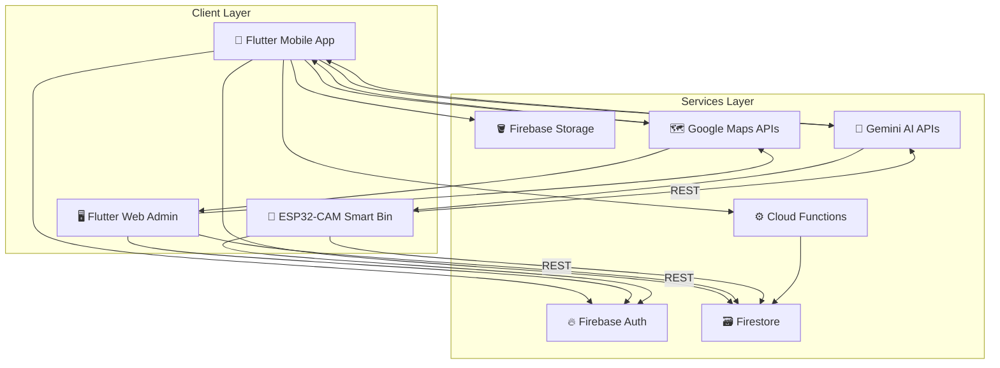
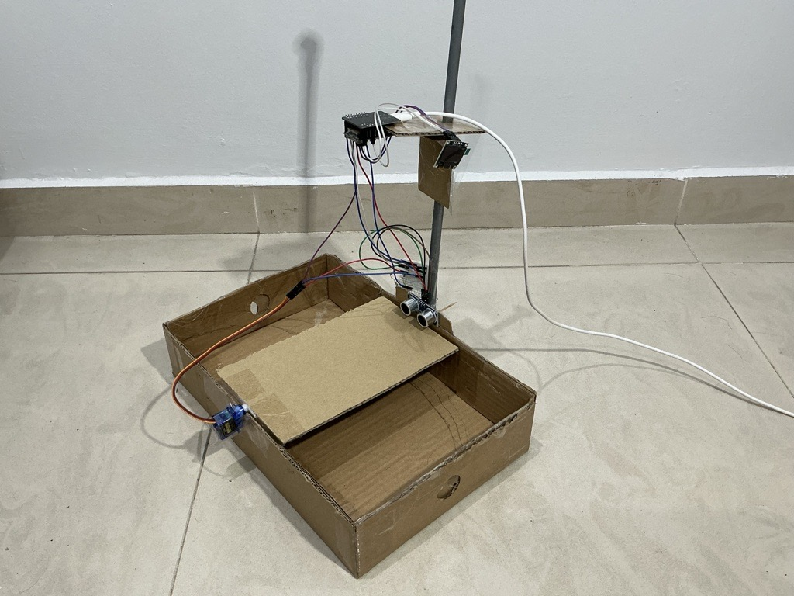

<div align="center">
    
    <h1>KitaKitar</h1>
    <h3><em>KitaKitar means "We Recycle" in Bahasa Malaysia</em></h3>
</div>

<p align="center">
    <strong>Scan It, Know It, Get There: AI-Powered Waste Identification with Turn-by-Turn Map Guidance to the Nearest Recycling Center or Smart Bin.</strong>
</p>

<p align="center">
  
  
  
  
  
</p>

<p align="center">
  
  
  
  
  
</p>

---

# 📖 What is KitaKitar?

**KitaKitar** is an app that takes the guesswork out of recycling. You take a photo of an item you want to throw away, and an AI tells you what it's made of and how to recycle it. Then comes the app's core feature: **KitaKitar guides you on a map, step by step, straight to the nearest recycling center or smart bin that accepts that item** — so you're never left wondering where to actually take it. When you arrive and drop off your item, you scan a QR code and earn a few points along the way.

The project has **three parts** (all share same *Backend*), kept in three folders:

- 📱 **`mobile/`** — the app people use on their phone: scan waste, get guided on a map to the nearest recycling center or smart bin, chat with an AI helper, and earn points along the way.
- 🖥 **`center_web/`** — a website recycling centers use to manage their location, the materials they accept, and the drop-offs they process.
- 🤖 **`smart_bin/`** — the computer code for an optional physical smart recycling bin that supports ultrasonic detection → camera capture → Gemini AI classification → servo sorting → on-device QR reward. Place an item in the chamber and the bin photographs it, asks Gemini for the category plus an estimated weight and carbon footprint, sorts it into the recyclable or residual compartment, and renders a reward QR on its OLED. Deposits made in quick succession accumulate into a single QR. No PC, no local server — just power and WiFi.

> 💡 The idea is simple:  
> If people recycle less because it’s **confusing, inconvenient, and unrewarding**, then KitaKitar turns it into a **guided, gamified, AI-assisted experience**.

---

# 🏗️ System Architecture



---

# 📸 Product Preview

> Real screenshots from the current build.

## Mobile App
<div align="center">
  <table>
    <tr>
      <th>Scan Waste</th>
      <th>AI Chat</th>
      <th>Nearby Centers</th>
      <th>Leaderboard</th>
      <th>Scan Result</th>
      <th>User Profile</th>
    </tr>
    <tr>
      <td align="center"></td>
      <td align="center"></td>
      <td align="center"></td>
      <td align="center"></td>
      <td align="center"></td>
      <td align="center"></td>
    </tr>
  </table>
</div>

## Admin / Center Web Panel
| Dashboard | Center Management | Transactions |
|-----------|-------------------|--------------|
|  |  |  |

## Smart Bin
<div align="center">
  <table>
    <tr>
      <th>ESP32-CAM Intake</th>
      <th>Sorting Recyclable Item</th>
      <th>Sorting Residual Waste</th>
    </tr>
    <tr>
      <td align="center"></td>
      <td align="center"></td>
      <td align="center"></td>
    </tr>
  </table>
</div>

---

# 🛠️ Configuration Guide

To run any of these, you need to connect them to a few free online services: **Firebase** (stores your data and logs people in), **Gemini** (Google's AI, which looks at photos and chats with users), and **Google Maps** (shows the map of recycling centers). The rest of this guide walks you through getting all of that set up, one small step at a time — **even if you have never done anything like this before.**

## Before you start: install the basic tools

You only need to do this once on your computer:

1. Install **Flutter** (the toolkit this app is built with): follow the official instructions for your operating system at https://docs.flutter.dev/get-started/install
2. Install **Android Studio** (to run the app on an Android phone/emulator): https://developer.android.com/studio
3. Make sure you have a free **Google account** (the same one you use for Gmail is fine) — you'll use it to create a Firebase project.

---

## STEP 1 — Get the project files onto your computer

Open a terminal and run:

```bash
git clone <repository-url>
cd KitaKitar
```

Then download the building blocks (called "packages") each part of the app needs:

```bash
cd mobile
flutter pub get
cd ../center_web
flutter pub get
cd ..
```

---

## STEP 2 — Create your free Firebase project

Firebase is a free Google service that will store KitaKitar's data (users, scans, recycling centers) and handle logins.

1. Open your browser and go to **https://console.firebase.google.com**
2. Sign in with your Google account.
3. Click **"Add project"** (or **"Create a project"**).
4. Type a name — anything you like, for example `KitaKitar`. Click **Continue**.
5. If asked about Google Analytics, you can turn the toggle **off** (not needed). Click **Create project**.
6. Wait a few seconds, then click **Continue** when it's ready.

You now have your own Firebase project! Keep this browser tab open — you'll come back to it a lot.

---

## STEP 3 — Turn on the features KitaKitar needs

Inside your new Firebase project, look at the menu on the left side of the screen.

**3a. Authentication (lets people log in)**
1. Click **Build → Authentication**, then **Get started**.
2. Open the **Sign-in method** tab.
3. Click **Email/Password**, turn the switch **Enable** on, click **Save**.
4. Click **Add new provider → Google**, turn it **Enable**, pick your email as the support email, click **Save**.

**3b. Firestore Database (stores app data)**
1. Click **Build → Firestore Database**, then **Create database**.
2. Pick a location near you (any option works), click **Next**.
3. Choose **Start in test mode** for now, click **Create**.
   *(We'll add the real, safe rules in Step 9 — don't worry about this for now.)*

**3c. Storage (stores uploaded photos)**
1. Click **Build → Storage**, then **Get started**.
2. Click **Next**, then **Done** (keep the default settings).

---

## STEP 4 — Register your apps and collect your keys

Firebase needs to know that your mobile app and your website exist. Registering them gives you a set of "keys" — text values you'll paste into the code in Step 5.

**4a. Register the Android app (for `mobile/`)**

1. Click the ⚙️ **gear icon** next to "Project Overview" (top-left), then **Project settings**.
2. Scroll down to **"Your apps"**, click the **Android icon**.
3. Under **Android package name**, type exactly:
   ```
   com.kitakitar.app
   ```
   *(This must match exactly — no spaces, no typos.)*
4. Give it any nickname, e.g. `KitaKitar Mobile`. Click **Register app**.
5. Click **Download google-services.json** — save the file somewhere you can find it (e.g. your Downloads folder).
6. **Move that downloaded file** into your project folder, so it sits exactly here:
   ```
   mobile/android/app/google-services.json
   ```
   (Create the file at that exact path/name — replace anything already there.)
7. Click **Next**, **Next**, then **Continue to console**. You can ignore the code snippets shown on screen — this project already has that code written for you.

**4b. Register the Web app (for `center_web/`)**

1. Still in **Project settings → Your apps**, click the **`</>`** (Web) icon.
2. Give it a nickname, e.g. `KitaKitar Center Web`. Leave "Firebase Hosting" unchecked. Click **Register app**.
3. A box of code appears containing something like:
   ```js
   const firebaseConfig = {
     apiKey: "AIzaSy...",
     appId: "1:...",
     messagingSenderId: "...",
     projectId: "...",
     storageBucket: "....firebasestorage.app"
   };
   ```
   **Keep this page open** — you'll copy these 5 values in the next step. (You can always come back later via **Project settings → Your apps → your web app**.)
4. Click **Continue to console**.

---

## STEP 5 — Paste the Firebase keys into the code

Open the project folder in a text/code editor (Android Studio or VS Code both work).

**5a. Mobile app**

Open the file you downloaded, `mobile/android/app/google-services.json`, with Notepad (or any text editor). It's a block of text with labelled values — use your editor's **Find** tool (Ctrl+F) to locate each one, then copy it across into `mobile/lib/firebase_options.dart`.

| Find this in `google-services.json` | Paste into `mobile/lib/firebase_options.dart`, line... |
|---|---|
| `"current_key"` (inside `"api_key"`) | **line 38** → `apiKey:` |
| `"mobilesdk_app_id"` | **line 39** → `appId:` |
| `"project_number"` | **line 40** → `messagingSenderId:` |
| `"project_id"` | **line 41** → `projectId:` |
| `"storage_bucket"` | **line 42** → `storageBucket:` |

For each line, replace only the text **between the quotes**, keep the quotes `'...'` and the comma `,` at the end. For example, line 38 currently reads:
```dart
apiKey: 'YOUR_ANDROID_API_KEY_HERE',
```
and should become (using your own real value):
```dart
apiKey: 'AIzaSyD4xxxxxxxxxxxxxxxxxxxxxxxxxxxx',
```

*(If you only plan to test on Android, you can leave the `ios` block — lines 45-52 — exactly as it is.)*

**5b. Center Web Panel**

Open `center_web/lib/firebase_options.dart`. Using the 5 values shown on the **Web app** page from Step 4b, fill in the **`web`** block:

| Value from the Firebase web config box | Paste into `center_web/lib/firebase_options.dart`, line... |
|---|---|
| `apiKey` | **line 29** |
| `appId` | **line 30** |
| `messagingSenderId` | **line 31** |
| `projectId` | **line 32** |
| `storageBucket` | **line 33** |

Same rule as before: replace only the text between the quotes. You can leave the `android` and `ios` blocks further down in this file untouched — the web panel only ever uses the `web` block.

---

## STEP 6 — Get a free Gemini AI key (for scanning + chat)

Gemini is the AI that looks at your waste photos and answers recycling questions.

1. Go to **https://aistudio.google.com** and sign in with your Google account.
2. Click **Get API key** (usually in the left menu).
3. Click **Create API key** (choose "create in new project" if it asks).
4. **Copy** the key that appears — it's a long string of letters/numbers.
5. In your project, go into the `mobile` folder and create a brand-new file named exactly:
   ```
   mobile/.env
   ```
   *(Yes, the file name starts with a dot and has no other name before it. If your file browser hides files starting with a dot, create it from a code editor instead.)*
6. Open that new file and type this single line, pasting your key after the `=`:
   ```env
   GEMINI_API_KEY=PASTE_YOUR_GEMINI_KEY_HERE
   ```
7. Save the file.

*(This `.env` file must exist for the app to build, even if you leave the key blank for now — but with a real key, AI scanning and chat will actually work instead of showing placeholder answers.)*

---

## STEP 7 — Get a Google Maps key (for the map)

There are two ways to get this key — pick whichever suits you.

### Option A — Free demo key (fastest, no billing/credit card required)

Google Maps Platform publishes a no-cost **demo key** meant exactly for
prototyping/evaluation like this project:

1. Go to [mapsplatform.google.com/maps-demo-key](https://mapsplatform.google.com/maps-demo-key/).
2. Click **Try for free**. This opens the Google Cloud console and
   provisions a demo key for you — just needs a Google account, no credit
   card and no billing setup.
3. Copy the key it shows you (starts with `AIza...`).

Fine print: the demo key covers a fixed bundle of APIs that includes **3D
Maps** (exactly what this project's map page uses), plus Dynamic Maps,
Geocoding, Places, Routes, and Weather. It has a **daily usage cap per API**
— once you exceed it for the day, the map simply stops responding until the
next day; you are not charged. It's explicitly scoped to **development and
testing, not production**.

### Option B — Your own key via Google Cloud Console (recommended if you want your own quota, no daily cap, or need it long-term)

1. Go to the [Google Cloud Console](https://console.cloud.google.com/).
2. At the top of the page, make sure the project selector shows the **same project** you created for Firebase (Firebase projects are also Google Cloud projects, so it will already be listed) — or create a new project via the top-left project dropdown → **New Project**.
3. In the search bar, type **"APIs & Services"** and open **Library**.
4. Search for and **Enable** each of these four (search the name, click into it, click the blue **Enable** button):
   - Maps SDK for Android
   - Maps SDK for iOS
   - Maps JavaScript API
   - Places API
5. Go to **APIs & Services → Credentials**, click **+ Create Credentials → API key**.
6. **Copy** the key shown (starts with `AIzaSy...`).
7. (Recommended, not required for local testing) Click **Restrict key** and
   restrict it to the APIs enabled above, and optionally to your app's
   package name / website referrer once you know them. An unrestricted key
   works fine for local development but shouldn't be left that way in a
   public repo's live config — this repo only ever ships placeholders, so
   each person's own key is theirs to restrict.
8. Make sure billing is enabled on the Cloud project. The Maps APIs
   require an active billing account, but Google's free monthly credit
   comfortably covers demo/dev usage. (Skip this whole option and use Option
   A above if you'd rather not set up billing at all.)

Now paste this same key in **two** places:

**7a. For the mobile app** — open (or create, if it doesn't exist yet) the file:
```
mobile/android/local.properties
```
> This file is normally created automatically the first time you open the `mobile/android` folder in Android Studio, or the first time you run `flutter run`. If it doesn't exist yet, do that once first, then come back to this step.

Add this new line at the very bottom of the file:
```properties
GOOGLE_MAPS_API_KEY=PASTE_YOUR_MAPS_KEY_HERE
```

**7b. For the Center Web Panel** — open:
```
center_web/web/index.html
```
Go to **line 36**. Replace only the text `[YOUR GOOGLE MAP API KEY]` with your key (keep everything else on that line exactly the same):

Before:
```html
<script src="https://maps.googleapis.com/maps/api/js?key=[YOUR GOOGLE MAP API KEY]&libraries=places&loading=async" async defer></script>
```
After:
```html
<script src="https://maps.googleapis.com/maps/api/js?key=AIzaSyXXXXXXXXXXXXXXXXXXXXXXXXXXXXXXX&libraries=places&loading=async" async defer></script>
```

---

## STEP 8 (optional) — Turn on "Sign in with Google" on Android

The app also works fine with plain Email/Password login, so you can skip this step and come back to it later.

1. In a terminal, run this command to get a code called a "SHA-1 fingerprint":
   ```bash
   keytool -list -v -keystore ~/.android/debug.keystore -alias androiddebugkey -storepass android -keypass android
   ```
2. Copy the line that starts with `SHA1:`.
3. In Firebase console → **Project settings → Your apps → your Android app**, click **Add fingerprint**, paste it in, and save.

---

## STEP 9 — Set up the database security rules

Right now your database is in "test mode", which is open to anyone. Let's apply KitaKitar's real rules:

1. Open `firebase/firestore.rules` in your code editor, select all the text, and copy it.
2. In Firebase console, go to **Build → Firestore Database → Rules** tab, delete what's there, paste in the copied text, and click **Publish**.
3. Open `firebase/storage.rules`, copy its contents the same way.
4. In Firebase console, go to **Build → Storage → Rules** tab, paste it in, and click **Publish**.

---

## STEP 10 — Run the app! 🎉

**Mobile app** (plug in an Android phone, or start an emulator from Android Studio first):
```bash
cd mobile
flutter run
```

**Center Web Panel** (opens in Chrome):
```bash
cd center_web
flutter run -d chrome
```

If everything above was filled in correctly, the app will open, you'll be able to sign up/log in, scan an item, and see the map. 🎊

---

## STEP 11 (optional) — Configure the Smart Bin hardware

Only follow this step if you actually have the ESP32-CAM smart bin hardware built — the parts list and wiring are below.

### Required Components

- `ESP32 Cam` (AI-Thinker, PSRAM) + `ESP32 Cam Mother Board`
- `HC-SR04 Ultrasonic Sensor`
- `1 kΩ + 2 kΩ resistors` (ECHO voltage divider)
- `Servo Motor`
- `SSD1306 OLED 0.96`
- `Jumper Wires`, `Type C Cable`
- `5 V ≥ 2 A power supply` (camera + WiFi TX + servo stall brown out smaller supplies)

### Hardware Configuration

| ESP32-CAM | Servo wire |
|-----------|---------|
| GPIO 12 Pin | Yellow / Orange Wire |
| 5V Pin | Red Wire |
| GND pin | Brown / Black Wire |

| ESP32-CAM | SSD1306 OLED 0.96 |
|-----------|---------|
| GND Pin | GND Pin |
| 3.3V Pin | VCC Pin |
| GPIO 15 Pin | SCL Pin |
| GPIO 14 Pin | SDA Pin |

| ESP32-CAM | HC-SR04 |
|-----------|---------|
| 5V Pin | VCC |
| GND Pin | GND |
| GPIO 13 Pin | TRIG (3.3 V drive is sufficient) |
| GPIO 2 Pin | ECHO **through the 1 kΩ / 2 kΩ divider** (HC-SR04 echoes at 5 V; GPIO 2 is not 5 V-tolerant) |


### Required Prerequisites

1. **Firebase Auth user for the bin** — Firebase Console → Authentication → Add user (email + password). This is the bin's own identity; revoking it disables the bin without affecting users or centers.
2. **Firebase Web API key & project ID** — Console → Project settings → General.
3. **Recycling-center document** — the `centers/{BIN_CENTER_ID}` doc must exist (redemption credits it and fails if it is missing).
4. **Dedicated Gemini API key** — [Google AI Studio](https://aistudio.google.com) → Get API key (do not reuse the mobile app's key).

### Arduino IDE Setup Guide

**ESP32 Environment**
1. Open **Arduino IDE** → **File → Preferences**
2. Add to **Additional Boards Manager URLs**:
   ```
   https://raw.githubusercontent.com/espressif/arduino-esp32/gh-pages/package_esp32_index.json
   ```
3. **Tools → Board → Boards Manager...** → install **esp32** by Espressif Systems

**Libraries** (Sketch → Include Library → Manage Libraries...)
1. **ESP32Servo** by Kevin Harrington, John K. Bennett
2. **ArduinoJson 7.x** by Benoit Blanchon
3. **Adafruit SSD1306** by Adafruit (+ its GFX/BusIO dependencies)

### Run

1. Copy `smart_bin/config.h.example` to `smart_bin/config.h`, then fill in:

   | Field | What to put there |
   |---|---|
   | `WIFI_SSID` / `WIFI_PASSWORD` | Your WiFi network's name and password |
   | `FIREBASE_PROJECT_ID` | The `projectId` value from Step 5 (Firebase console → Project settings → General also shows this as "Project ID") |
   | `FIREBASE_API_KEY` | The same Web API key from Step 4b/5b |
   | `BIN_AUTH_EMAIL` / `BIN_AUTH_PASSWORD` | The bin's Firebase Auth login from the Prerequisites above |
   | `BIN_CENTER_ID` | Firebase console → Firestore Database → the `centers` collection → click on your recycling center's entry → copy its document ID |
   | `GEMINI_API_KEY` | The dedicated Gemini key from the Prerequisites above |

   (`config.h` is already excluded from git — see `.gitignore` — so your real values will never be accidentally committed.)
2. Connect the ESP32-CAM via USB-C.
3. Tools → Board → esp32 → **AI Thinker ESP32-CAM** (PSRAM enabled), choose your Port.
4. Click **Upload**, then press the board's **Reset** button.
5. Tools → **Serial Monitor** (115200 baud) — you should see WiFi connect and `[AUTH] Signed in`.
6. Drop an item within 20 cm of the ultrasonic sensor. Your KitaKitar Smart Bin is ready!

Or from the CLI: `arduino-cli compile --fqbn esp32:esp32:esp32cam smart_bin`.

### Classification & Rewards

| Gemini category | Stored material slug | Compartment |
|---|---|---|
| glass | `glass` | recyclable |
| milk_carton | `paper` | recyclable |
| cardboard | `paper` | recyclable |
| metal | `metal` | recyclable |
| plastic | `plastic` | recyclable |
| can | `aluminum` | recyclable |
| residual / unknown | — | residual (no QR) |

Weight and CO₂e are **AI-estimated per item** (clamped to 0.005–3.0 kg and 0–5.0 kg) and stored on the QR document. The app computes points as `round(Σ weight×100×1.5 + co2×100)` at redemption.

---

# 🆘 Something not working?

- **App shows "Firebase not configured"** → Double-check every value in `firebase_options.dart` was pasted between the quotes correctly, with no extra spaces, and that you saved the file.
- **"Permission denied" errors on scans/map** → You probably haven't published the rules yet — redo Step 9.
- **Map doesn't load / is blank** → Make sure all 4 Google Maps APIs are enabled (Step 7) and the key was pasted in the right file with no typos.
- **Build fails after pulling new code** → Try:
  ```bash
  flutter clean
  flutter pub get
  ```

---

# 🔒 Keep your keys private

Never share or commit these files publicly — they contain your personal keys:
`mobile/.env`, `mobile/android/local.properties`, `mobile/android/app/google-services.json`, `smart_bin/config.h`. They are already listed in `.gitignore` so a normal `git add`/`git commit` won't include them.

---

# 🏆 Hackathon Achievements

<p align="center">
  
</p>

---

<div align="center">

**KitaKitar — Scan It, and We'll Guide You There. Together.**

</div>
